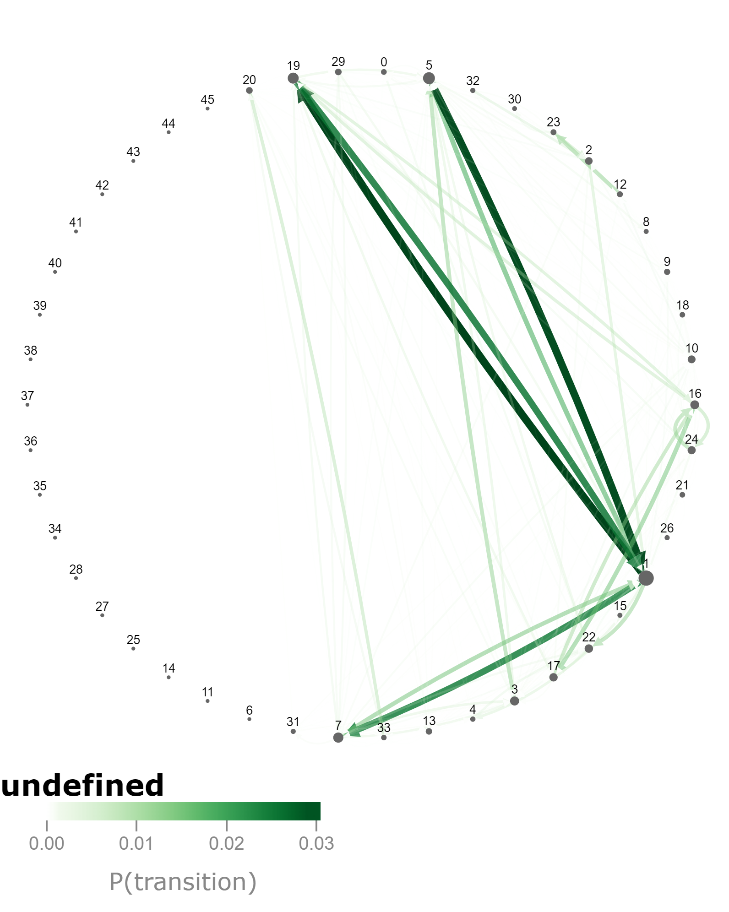

# Tools
To access options for a certain module click the gear icon in the upper right of that module.
### Layout
Options allowing for the modification of the window in which the data is presented.
### Data
Select a filter set in the sidebar to allow only certain data to be visualized.
### Snapshot
Takes a snapshot of the current window with options to change renderer, output format, image quality, scale, and background color. Alternatively use the camera icon to take a snapshot in the upper right corner of the module.

# Component
## Behvioral Distance Heatmap
|
:-------------------------:|:-------------------------:
Heatmap|Options

Steryotype movements mice produce from kinect camera
### Behavioral Distance Metric
### Colormap
Changes the color spectrum for which cells are shaded.
### vMin and vMax
Changes the minimum and maximum values displayed on heatmap. In the mapping from numbers to color, vMin and vMax are the maximum color anything past those values wil be that color.
### Row and Column Ordering
#### ID
Sort by ordering of module labels, most used animal
#### Value
Sort by values
#### Hierarchical Cluster
Uses hierarchical clustering to define the order. Organizes rows such that close together are physically close and vice versa.
#### K-Means Cluster
Performs k means clustering over data and ordering is used. Shows breaks between clusters.
#### Dataset
Use an arbitrary dataset to define the order. Allows order from different comonents to be used. Datasets are generated by other heatmaps. 

## Crowd Movies
|
:-------------------------:|:-------------------------:
Movie|Options

### Loop Playback
Loops the current video.
### Playback Rate
Changes the speed at which the movie is running.

## Individual Usage Heatmap
|
:-------------------------:|:-------------------------:
Heatmap|Options

### Colormap
Changes the color spectrum for which cells are shaded.
### vMin and vMax
Changes the minimum and maximum values displayed on heatmap.
### Row and Column Ordering
#### ID
Sort by ordering of module labels, most used animal
#### Value
Sort by values
#### Hierarchical Cluster
Uses hierarchical clustering to define the order. Organizes rows such that close together are physically close and vice versa.
#### K-Means Cluster
Performs k means clustering over data and ordering is used. Shows breaks between clusters.
#### Dataset
Use an arbitrary dataset to define the order. Allows order from different comonents to be used. Datasets are generated by other heatmaps. 
### Color Column Labels

## Module Clips
|
:-------------------------:|:-------------------------:
Clip|Options

### Video Stream
Allows the clip to be shown in RGB, as a depthmap, or both side by side.
### Only Module Subclip
Excludes context of pre and post behavior.
### Loop Playback
Loops the current clip.
### Playback Rate
Changes the speed at which the clip is running.

## Position Plot
|
:-------------------------:|:-------------------------:
Plot|Options

### Display Mode
Changes whether position plot for all data groups combined(Overall) or individually(Grouped).
### Colormap
Changes the color spectrum for which cells are shaded.
### Resoution
Increases(lower value) or decreases(higher value) the resolution of the plot. 

## Sample Viewer

## Scalar Data
|
:-------------------------:|:-------------------------:
Data|Options

### Metric
Selection of metrics for the given data to be displayed.
### Point Size
Changes the size of the point.
### Boxplot Whiskers
Select between Tukey and Min/Max boxplot whiskers.
### Violin KDE Scale
Modifies the scale of the Violin KDE.

## Selected Syllable

## Spinogram
|
:-------------------------:|:-------------------------:
Spinogram|Options

### Line Weight and Color
Changes the thickness and color of the displayed lines.

## State Map
|
:-------------------------:|:-------------------------:
Map|Options

### Group to Plot
Select the group to display.
### Show Relative Differences
Subracts values of group B from group A. Plot those relative differences.
### Prune Transition Threshold
Value indicates which values to be excluded from plot, can get busy at very low values.
### Layout
Select the layout the map should be displayed in.
### Colormap
Changes the color spectrum for which lines are shaded.
### Use Transparancy

## Syllable Flow
|
:-------------------------:|:-------------------------:
Syllable Flow|Options

### Group to Plot
Select the group to display.
### Show Relative Differences
### Prune Transition Threshold
### Node Alignment
### Node Width and Padding
Changes the width of each node and the space between them.

## Usage Details
|
:-------------------------:|:-------------------------:
Usage Details|Options

### Group Ordering
Change order of groups by filter order or by dataset.
### Point Size
Changes the size of the point.
### Boxplot Whiskers
Select between Tukey and Min/Max boxplot whiskers.
### Violin KDE Scale
Modifies the scale of the Violin KDE.

## Usage Heatmap
|
:-------------------------:|:-------------------------:
Heatmap|Options

### Colormap
Changes the color spectrum for which cells are shaded.
### vMin and vMax
Changes the minimum and maximum values displayed on heatmap.
### Row and Column Ordering
#### ID
Sort by ordering of module labels, most used animal
#### Value
Sort by values
#### Hierarchical Cluster
Uses hierarchical clustering to define the order. Organizes rows such that close together are physically close and vice versa.
#### K-Means Cluster
Performs k means clustering over data and ordering is used. Shows breaks between clusters.
#### Dataset
Use an arbitrary dataset to define the order. Allows order from different comonents to be used. Datasets are generated by other heatmaps. 