# Tools
The heart of `moseq-reports` are its tools, or predefined visualizations, available from the `Tools` menu in the application menu bar. Here we describe the tools and related functionality. Further below, the specifics for each tool are described.
To access options for a certain module click the gear icon in the upper right of that module.

## General Tool Settings
Specific Settings can be accessed by clicking the gear icon in the title bar of the component. After clicking this button, a modal dialog will appear that offers settings for this component instance. There are a number of common tabs within this dialog:

### Layout
This tab contains options allowing for the modification of the window in which the data is presented. One may change the `X` and `Y` position of the window, as well as its `width` and `height`, or reset the dimensions to the default size. There is also a input to change the title displayed on the window. Finally, there is a button to duplicate the component, useful for cloning a component along with its settings.

### Data
Select a filter from the data filters collection in the sidebar to bind to this tool. This allows only certain data to be visualized, potentially a different subset from other tools.

### Component
This tab contains tool-specific settings. See the documentation further below for specific details for a given tool.

### Snapshot
This tab contains settings related to component rendering and snapshots. What good are your visualizations if you cannot share them with anyone else? Snapshots are a way to save your tools visualization to an image file (typically png or svg images).

The `Preferred Renderer` renderer field allows you to change how the data is rendered. Many components support rendering to SVG or Canvas. SVG renderers use vector graphics, and tend to look better on-screen and in saved images, but can suffer in performance with large datasets. Canvas renderers use raster graphics, but tend to be performant even with larger datasets.

The `Output Format` field controls the output format of a snapshot. The availability of different formats depends on the renderers supported by the tool. Typically, SVG renderers can produce SVG or PNG images, while canvas renderers can only produce PNG images. Video renderers can produce a video file, or PNG will produce a snapshot of the current video frame.

The `Quality` field controls the quality of the saved image, typically only when using PNG outputs.

The `Scale` field allows you to increase the resolution of the resulting image file by up-scaling the current render.

The `Background Color` field allows you to set a background color for the resulting image. By default this is a fully transparent white.

Finally, there is a button which allows you to take a snapshot of the tool. Alternatively use the camera icon on the tool window title bar to take a snapshot.

# Specific Tools
Below we describe the different tools and give an explanation for their various settings.

## Behavioral Distance Heatmap
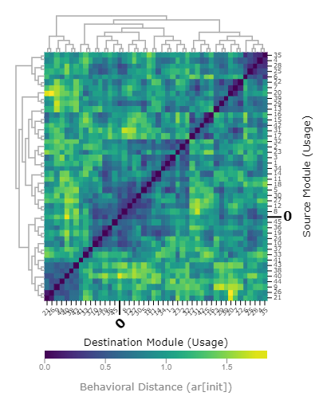

This tool displays a heatmap visualizing the "behavioral distance" between any two moseq syllables. The moseq behavioral distance was first described in [`Markowitz et al. 2018. DOI: 10.1016/j.cell.2018.04.019`](https://doi.org/10.1016/j.cell.2018.04.019), but briefly the metric estimates the similarity between any two given syllables.

There are several available underlying metrics available.
- `ar[init]` and `ar[dtw]` both use the autoregressive data learned by moseq during model training and estimate the similarity in the trajectory through behavioral space between syllables. The `dtw` variant uses dynamic time warping to try to improve alignment between syllable trajectories.
- `pca[dtw]` looks at the PCA embedding between syllables, and also uses dynamic time warping.
- `scalars[**]` looks at the underlying scalar data, such as height or velocity to compute the distance.

### Settings
Setting|Description
:--|:--
Behavioral Distance Metric|Changes the moseq behavioral distance metric being visualized.
Colormap|Changes the color scheme of the heatmap.
vMin and vMax|Changes the minimum and maximum values displayed on heatmap. In the mapping from numbers to color, vMin and vMax are the maximum color anything past those values wil be that color.
Row and Column Ordering|Allow you to change how the rows or columns are ordered. The value `ID` will sort by the syllable ID. The value `Value` will allow you to sort by the value of one specific syllable. The value `Hierarchical Cluster` will perform hierarchical clustering on the data. In this case, you also have a choice of distance metric and linkage method, which both affect the displayed dendrogram. The value `K-means Cluster` will perform k-means clustering on the data, and the data is displayed with breaks indicating the group boundaries. In this case you also have the parameter K which controls the number of clusters produced. The value `Dataset` allows you to sort by the order given by a dataset produced by another tool in the current window.

## Crowd Movies

This tool displays “crowd movies”, or videos where many examples of a given moseq syllable which are synchronized to the syllable start and overlaid. A red dot over each mouse indicates the active performance of the current syllable.

### Settings
Setting|Description
:--|:--
Loop Playback|Enabling this setting will cause the movie to loop back to the beginning and play again once the video has completed playing. Disabling this setting will cause the video to stop once it has completed playing.
Playback Rate|Sets the playback rate of the video. A value of one (1.0) results in normal playback speed. Values greater than 1.0 result in faster playback, and values less than 1.0 (but greater than zero) result in slower playback. For example, a value of 0.5 will cause the video to play at half the normal speed.

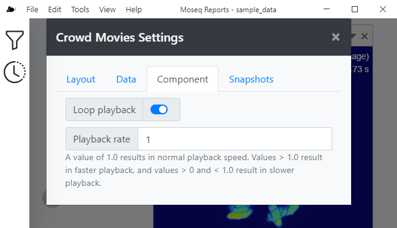

## Data Query

This tool allows you to make arbitrary queries into the underlying data system to return new datasets. These datasets can be then downloaded or published to a data filter to enable consumption by other tools that support Datasets. This tool provides no additional settings in the component settings tab, all manipulations occur in the tool window.

Begin by selecting a dataset to be loaded under the header `Data Source`. Once selected the results of that operation are available below by expanding the header `Results at this stage`.

Add another `Operation` to the chain by selecting a new operation from the `Add Operation` menu.

Operation|Description
:--|:--
Map|Map the data to another format, or select only a subset of columns.
Filter|Filter values by column values
Aggregate|Aggregate data
Sort|Sort data
Pluck|take the value of a single column
Keys|Take the keys
Values|Take the values

Finally, the `Publish Dataset` block allows you to download the final result of your operations by clicking the cloud download button. You may also publish your dataset to the bound data filter by toggling the switch next to the `Dataset Name` field. Publishing your dataset makes the data available for consumption by other components. You can affect the name under which your dataset is pubilished using the `Dataset Name` Field.

## Individual Usage Heatmap
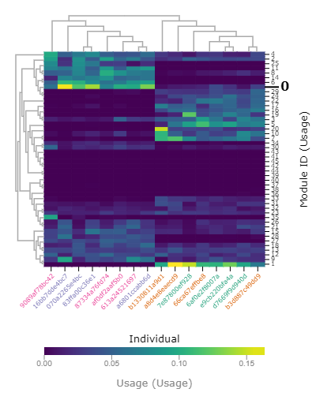
This tool visualizes the how often each syllable is used by each individual mouse/session.
    

### Settings
Setting|Description
:--|:--
Colormap|Changes the color scheme of the heatmap.
vMin and vMax|Changes the minimum and maximum values displayed on heatmap. In the mapping from numbers to color, vMin and vMax are the maximum color anything past those values wil be that color.
Row and Column Ordering|Allow you to change how the rows or columns are ordered. The value `ID` will sort by the syllable ID. The value `Value` will allow you to sort by the value of one specific syllable. The value `Hierarchical Cluster` will perform hierarchical clustering on the data. In this case, you also have a choice of distance metric and linkage method, which both affect the displayed dendrogram. The value `K-means Cluster` will perform k-means clustering on the data, and the data is displayed with breaks indicating the group boundaries. In this case you also have the parameter K which controls the number of clusters produced. The value `Dataset` allows you to sort by the order given by a dataset produced by another tool in the current window.
Color Column Labels|Enabling this setting allows you to color the column label text by the value in the dropdown box. Currently, coloring by group name is supported.

## Mutation Plot
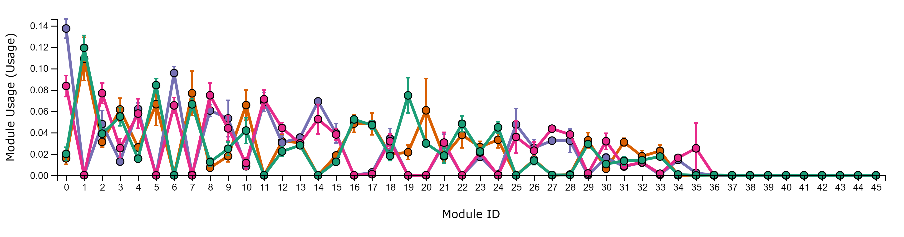
This tool provides a way to visualize the frequency of syllable emissions as a line plot. It also features a clever way to sort the syllables by the difference in syllable usage between two groups

Setting|Description
:--|:--
Syllable Ordering|This setting affects the order of syllables across the x-axis. The value `ID` will plot the syllables in ascending order across the x-axis. The value `Value` will plot the syllables based on their values. In this case, the additional settings `Sort By` allows you to select the group from which the values will be taken for computing the sort order, and the `Direction` allow you to choose whether to sort in ascending or descending order. The value `Value Difference` allows you to sort the syllables by the difference in usage between groups, calculated as `minuend - subtracted`. The value `Dataset` allows you to sort by the order given by a dataset produced by another tool in the current window.
Point Size|If enabled, the plot will draw points, and if disabled, the points will be hidden. The numerical value affects the size of the drawn points, with larger values resulting in larger points.
Line Weight|If enabled, draw lines connecting adjacent points within a group, and if disabled, will hide the lines. The numerical value affects the weight of the drawn lines.
Error Bars|If enabled, draw error bars for each point, and if disabled, hides the error bars. The dropdown allows you to select the method used for calculation of the error bar data. The value `SEM` will use the standard error of the mean, which the value `95% CI` will use a 95% confidence interval.

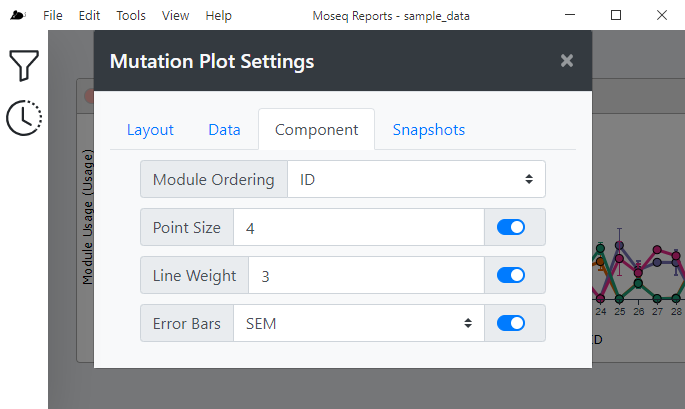

## Position Plot

Displays the relative occupancy of animals in the arena during performance of the current moseq syllable as a normalized 2D histogram using hexagon tiles. You can view the overall occupancy across all groups, or you can view occupancy within individual groups.

### Settings
Setting|Description
:--|:--
Display Mode|Affect how the data grouped and plotted. The value `Overall` will group all data together and show occupancy across all groups. The value `Grouped` will split data by group membership and display a visualization for each group.
Colormap|Changes the color scheme of the heatmap.
Resolution|Changes the spatial resolution of the underlying histogram. Smaller values increase the resolution of the plot while higher values decrease the resolution of the plot.

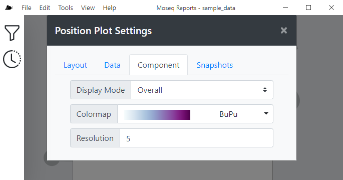

## Sample Viewer
This tool displays general information such as UUID, Group, Apparatus, Session Name, Subject Name, and Acquisition Time of the groups in the dataset while also allowing this data to be filtered by any of this information. This tool has no additional settings.

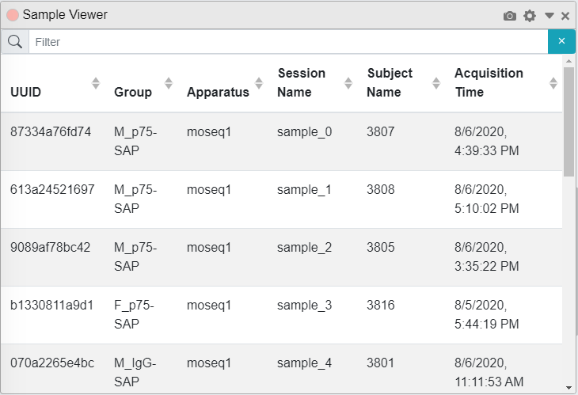

## Scalar Data
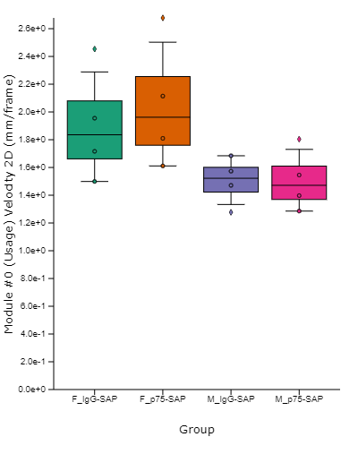
This tool allow you visualize several "scalar metrics", such as height or velocity, while animals perform the current syllable.  displays the magnitude of the selected units of measurements for each group in a moseq module.
   

### Settings
Setting|Description
:--|:--
Metric|Changes the scalar metric to visualize in the plot to one of the following: Angle, Velocity 2D, Velocity 3D, Velocity Theta, Width, Height, or Area
Point Size|Enabling this option will display individual data points on the plot, while disabling this option will hide the points. Changing the numerical value affects the size of the points, with larger values producing larger points.
Boxplot Whiskers|Enabling this option will display the data distribution as a box plot, while disabling this option will hide the box plots. The dropdown allows you to select the methodology used for drawing the box plot whiskers. The value `Tukey` will draw Tukey-style whiskers where the whiskers will extend up to `1.5 * IQR` from 25th and 75th percentile. The value `Min/Max` will draw whiskers that extend to the minimum and maximum values of the data.
Violin KDE Scale|Enabling this option will display the data distribution as a violin plot, while disabling this option will hide the violin plot. Changing the numerical value affect the scale of the kernel density estimation (KDE) used to generate the violin plot. Larger values produce a more coarse violin while smaller values produce a more fine violin.

## Selected Syllable
This tool displays the currently selected Moseq Syllable. This tool has no additional settings.
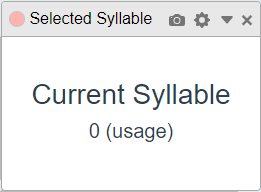

## Spinogram
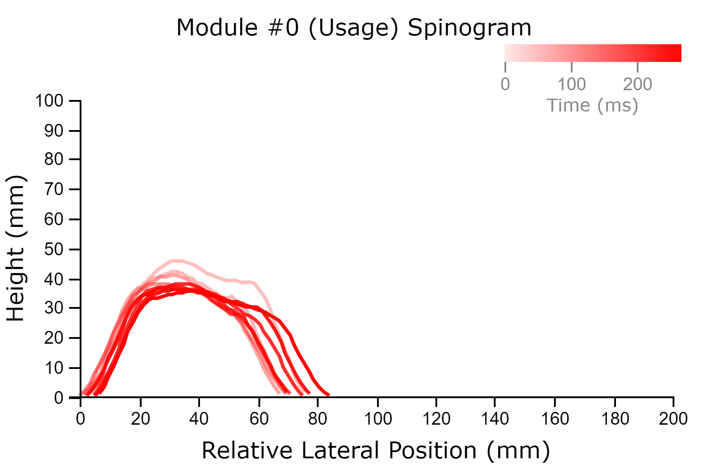
This tool displays “spinograms”, or a visualization of the height of a mouse’s spine (really the
axial midline) over the time course of the expression of the current moseq syllable. Spinograms were first shown in [`Wiltschko et al. 2015. DOI: 10.1016/j.neuron.2015.11.031`](https://doi.org/10.1016/j.neuron.2015.11.031). Essentially, the mouse spine height is sampled at multiple points across the syllable performance. If the mouse translates in the x/y position, the line for that time point is also translated accordingly. Samples earlier in the performance are drawn with more transparency than samples later in the performance.

### Settings
Setting|Description
:--|:--
Line Weight|Allows you to change the thickness of the plotted lines.
Line Color|Allows you to change the color of the plotted lines

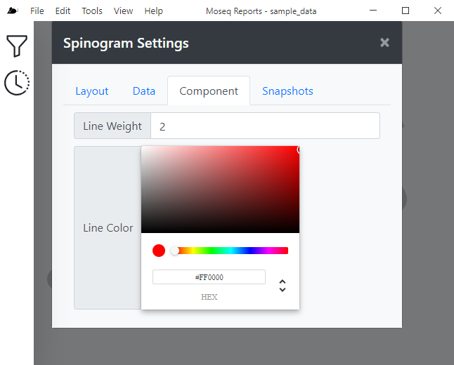

## State Map

This tool provides a way to visualize transition probabilities as a graph consisting of nodes (representing the syllables, the size of which indicates the frequency they are emitted) connected by directed edges/links (representing the probability of a transition from one syllable to another, the weight and color of which indicate the probability magnitude). The tool can be used to visualize one group at a time, or to compare the difference in transition probabilities between two groups. Several layouts are available to affect how nodes and edges are drawn.

### Settings
Setting|Description
:--|:--
Group to Plot|Allows you to select the group to be plotted.
Show Relative Differences|If disabled, will only plot the transition probabilities of the group selected in `Group to Plot`. If enabled, will compute the relative difference between two groups, calculated as `TP(Group to Plot) - TP(Relative To Group)`. When using this option, it is recommended to choose a diverging colormap.
Prune Transition Threshold|Allows you to set a threshold for pruning transitions from the graph. Transitions with probability lower than this threshold will be pruned, preventing them from appearing on the plot. Lower values will result in more edges being drawn, and very low values can result in quite busy looking plots. A value of `0` effectively disables this functionality.
Layout|Allows you to select a layout algorithm for organizing the plotted nodes and edges. Most of the layout algorithms have additional options that effect how nodes and edges are placed.
Colormap|Changes the color scheme of the drawn graph edges. If using `Show Relative Differences`, it's suggested to choose a diverging colormap, otherwise a non-diverging colormap is more suitable.
Use Transparency|Turns on or off transparency of the edges. When enabled, the opacity of a given edge is proportional to the value of that transition. Enabling this option typically results in a better looking visualization.

## Syllable Clips

This component displays “module clips”, or specific single examples of a given moseq syllable using RGB, depth, or composed (both) video streams. A red dot is displayed in the upper left hand corner of each video indicating when the current module is being actively performed.

### Settings
Setting|Description
:--|:--
Video Stream|Allows you to select which video stream is displayed. Options are RGB (color video), Depth (false-color depth video), or Composed (both RGB and Depth are displayed side by side).
Only Module Subclip|The videos displayed by this tool typically include 2 seconds prior and 2 seconds post the current syllable performance. If this option is disabled, the full clip (including before and after syllable performance) will be displayed. If this option is enabled, only the subclip showing performance of the current module is displayed. Be aware that due to video player limitations, the precision of this temporal cropping may not be ideal!
Loop Playback|Enabling this setting will cause the movie to loop back to the beginning and play again once the video has completed playing. Disabling this setting will cause the video to stop once it has completed playing.
Playback Rate|Sets the playback rate of the video. A value of one (1.0) results in normal playback speed. Values greater than 1.0 result in faster playback, and values less than 1.0 (but greater than zero) result in slower playback. For example, a value of 0.5 will cause the video to play at half the normal speed.

## Syllable Flow

This tool provides a way to visualize incoming or outgoing transition probabilities relative to the currently selected syllable as a [sankey diagram](https://en.wikipedia.org/wiki/Sankey_diagram).

The plot is arranged as a series of nodes representing syllables, connected by edges representing the probability of transition between the incoming or outgoing syllable and the currently selected syllable (rooted in the center of th diagram). The width (and possibly the color, if using the setting `Show Relative Differences` is enabled) are proportional to the probability of a transition.

### Settings
Setting|Description
:--|:--
Group to Plot|Allows you to select the group to be plotted.
Show Relative Differences|If disabled, will only plot the transition probabilities of the group selected in `Group to Plot`. If enabled, will compute the relative difference between two groups, calculated as `TP(Group to Plot) - TP(Relative To Group)`. When using this option, it is recommended to choose a diverging colormap.
Prune Transition Threshold|Allows you to set a threshold for pruning transitions from the graph. Transitions with probability lower than this threshold will be pruned, preventing them from appearing on the plot. Lower values will result in more edges being drawn, and very low values can result in quite busy looking plots. A value of `0` effectively disables this functionality.
Node Alignment|Affects the alignment of the sankey nodes.
Node Width|Affects the width of the sankey nodes.
Node Padding|Affects the spacing between adjacent sankey nodes.

## Transitions Heatmap
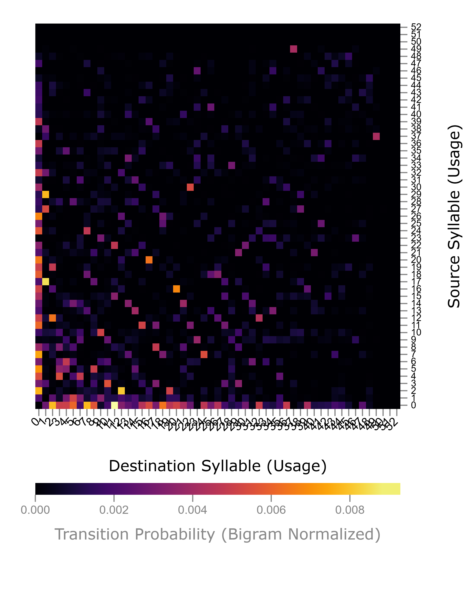

This tool provides a way to visualize the transition probability matrix as a heatmap. You have the option to display the overall transition probability matrix across all animals, of for a single particular group. You may also choose to normalize the data using bigram, row, or column normalization.

### Settings
Setting|Description
:--|:--
Mode|Choose from `Overall` to plot across all groups, or `Single Group` to plot the transitions from one single group. In the case of the latter, you have the opportunity to select the specific group to be plotted via the `Group to Plot` field.
Normalization|Choose from `Bigram`, `Rows` or `Cols`
Colormap|Changes the color scheme of the heatmap.
vMin and vMax|Changes the minimum and maximum values displayed on heatmap. In the mapping from numbers to color, vMin and vMax are the maximum color anything past those values wil be that color.
Row and Column Ordering|Allow you to change how the rows or columns are ordered. The value `ID` will sort by the syllable ID. The value `Value` will allow you to sort by the value of one specific syllable. The value `Hierarchical Cluster` will perform hierarchical clustering on the data. In this case, you also have a choice of distance metric and linkage method, which both affect the displayed dendrogram. The value `K-means Cluster` will perform k-means clustering on the data, and the data is displayed with breaks indicating the group boundaries. In this case you also have the parameter K which controls the number of clusters produced. The value `Dataset` allows you to sort by the order given by a dataset produced by another tool in the current window.

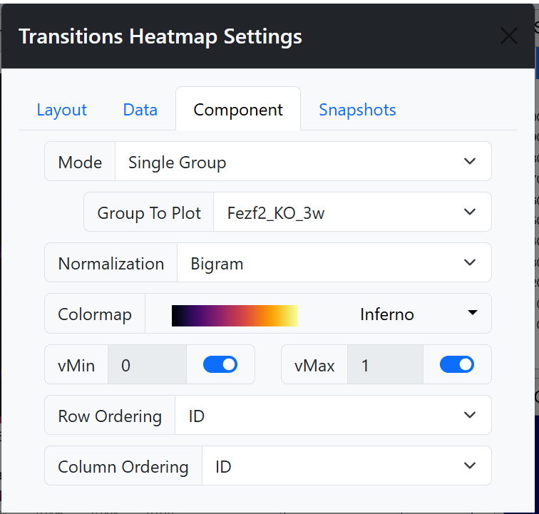

## Usage Details

This tool allow you visualize the frequency of syllable emissions across different groups, displaying data using box plots, violin plots, or swarm plots.
   

### Settings
Setting|Description
:--|:--
Group Ordering|Allows you to select the ordering of the groups across the x-axis. The value `Filter Order` will use the ordering as specified by the bound data filter. The value `Dataset` will use the order from a published dataset.
Point Size|Enabling this option will display individual data points on the plot, while disabling this option will hide the points. Changing the numerical value affects the size of the points, with larger values producing larger points.
Boxplot Whiskers|Enabling this option will display the data distribution as a box plot, while disabling this option will hide the box plots. The dropdown allows you to select the methodology used for drawing the box plot whiskers. The value `Tukey` will draw Tukey-style whiskers where the whiskers will extend up to `1.5 * IQR` from 25th and 75th percentile. The value `Min/Max` will draw whiskers that extend to the minimum and maximum values of the data.
Violin KDE Scale|Enabling this option will display the data distribution as a violin plot, while disabling this option will hide the violin plot. Changing the numerical value affect the scale of the kernel density estimation (KDE) used to generate the violin plot. Larger values produce a more coarse violin while smaller values produce a more fine violin.

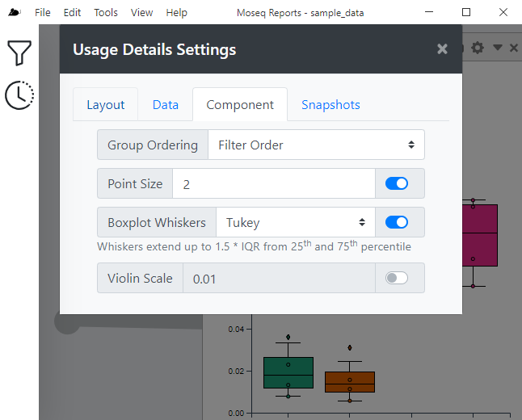

## Usage Heatmap

This tool allows you to visualize the frequency of syllable emissions across different groups as a heatmap. Groups are arranged as columns of the heatmap, and syllables as the rows. The color in any given cell is proportional to how often the syllable is used by a particular group. The heatmap allows hierarchical or k-means clustering, as well as other sorting methods. Clicking on a cell in the heatmap updates the bound data filter's currently selected syllable.

Setting|Description
:--|:--
Colormap|Changes the color scheme of the heatmap.
vMin and vMax|Changes the minimum and maximum values displayed on heatmap. In the mapping from numbers to color, vMin and vMax are the maximum color anything past those values wil be that color.
Row and Column Ordering|Allow you to change how the rows or columns are ordered. The value `ID` will sort by the syllable ID. The value `Value` will allow you to sort by the value of one specific syllable. The value `Hierarchical Cluster` will perform hierarchical clustering on the data. In this case, you also have a choice of distance metric and linkage method, which both affect the displayed dendrogram. The value `K-means Cluster` will perform k-means clustering on the data, and the data is displayed with breaks indicating the group boundaries. In this case you also have the parameter K which controls the number of clusters produced. The value `Dataset` allows you to sort by the order given by a dataset produced by another tool in the current window.

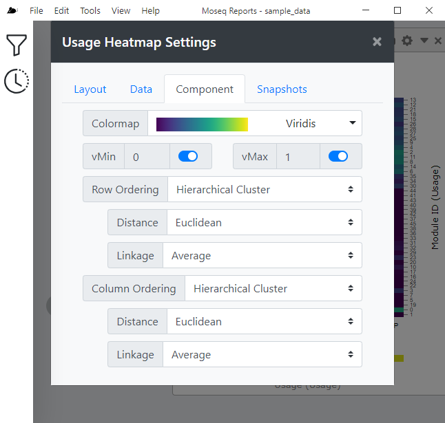

