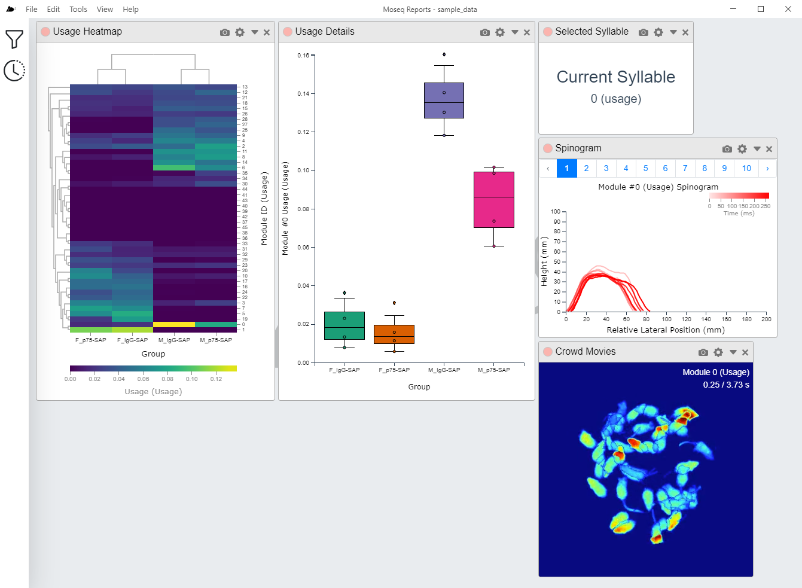
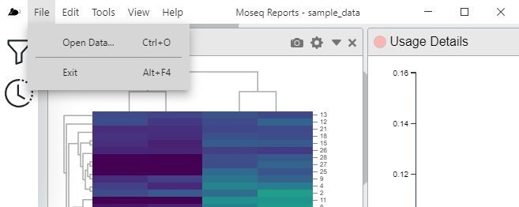
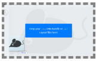
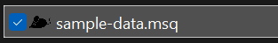
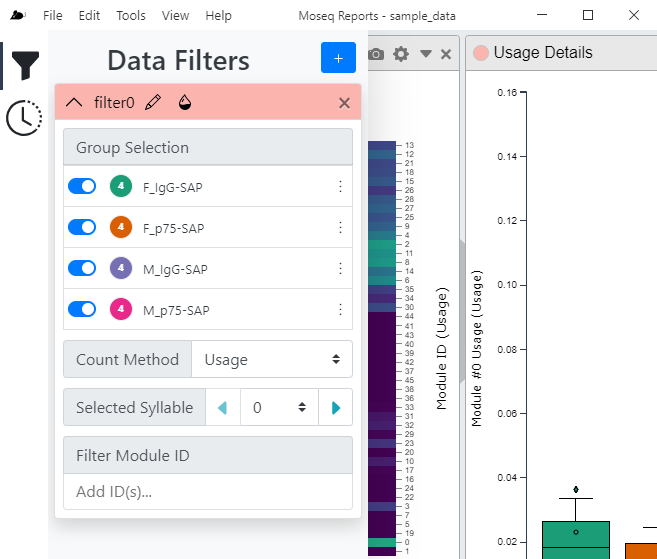
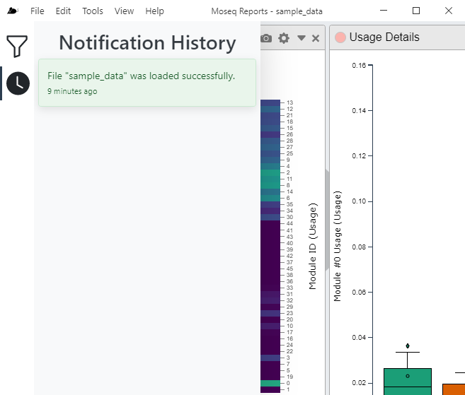
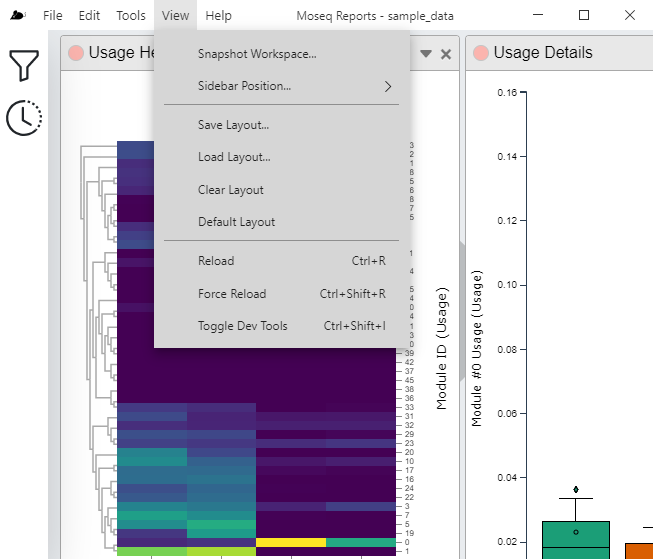

# Using Moseq Reports

## Loading Data
You should have a file ending with the `*.msq` file extension. This file contains the data to be loaded into moseq-reports. There are several ways to trigger moseq-reports to load your file.

### From the Main Menu
In the main application menu, click `File → Open Data`. A file load dialog will appear, allowing you to navigate and select your `*.msq` file.

### Drag and Drop
The application allows you to drag and drop a `*.msq` file from your computers file explorer into the application window. Dropping the file within the window will trigger moseq-reports to load your file.

### File Associations
Upon install, moseq-reports will register the `*.msq` file extension with the operating system, associating it with the moseq-reports application. Afterwards, `*.msq` files should display in your file explorer with the mouse icon, and double clicking the file will load that `*.msq` file into moseq-reports.

## Data Filters
Data filters allow you to manipulate and filter data pulled from your `*.msq` file. Often you may want to display only a subset of groups in your visualization. To turn a group on or off, click the switch next to the group. You can reorder the groups by dragging/dropping the group row (grab at the vertical ellipsis). This will change the group order on plots that use this group order. There is also a color swatch next to each group name. The number within tells you the number of moseq sessions belong to that group. The color of the swatch indicates the color that will be used for that group throughout visualizations. You may change the default color by clicking on the swatch and selecting a new color from the color picker.

The data filter also keeps track of the current count method (`usage` or `frames`), as well as the currently selected syllable. Tools that display data from only one syllable will typically be bound to this value, and several tools may update this value when a particular piece of data is clicked on. The `Filter Syllable ID` box allows you to keep only a subset of syllables available for tools to display.

Upon loading an `*.msq` file into moseq-reports, the Data Filters pane in the application side bar will become active. To open or close the filters, click on the Filter button in the side bar. The default filter, typically named `filter0` will be added for you.

If you require additional filters (useful if you wanted to compare different group subsets, or say compare usage counting vs frames counting), you may always add another filter using the add button at the top right of the DAta Filters pane. Don't forget to bind your tools to the new data filter!

## Notification History
Also, the notification history lives in the application sidebar, activated by the clock button. This keeps a record of notifications shown to you since the application was started. If you miss a notification, or want more details, visit the notification history pane to review these message

## Layouts
Layouts provide a way for you to save or load application state between different sessions of using moseq-reports. Layouts include information on the tool windows (layout, data, settings) as well as filters. When you first load your data into moseq-reports, the Default Layout will be applied. Layouts are stored as files ending with the `*.msl` file extension.

### Loading a Layout
There are two ways to load a layout. The first is from the application main menu bar, select `View → Load Layout`. A file selection dialog will appear where you can select the layout file that you want to load. Clicking load will then load your layout file. Another way to load your layout file is to drag and drop your `*.msl` from your operating systems file explorer into the moseq-reports application window. In either case, the current layout will be cleared and your new layout will be applied.

The Default Layout contains a small number of common tools. The Default Layout can be loaded from the application main menu bar, select `View → Default Layout`. The current layout will be cleared and the default layout applied.

### Saving a Layout
To save a layout, from the application main menu bar, select `View → Save Layout`. A file save dialog will appear, allowing you to select a file name and location to save your layout file

### Clearing the Current Layout
To clear the current layout, from the application main menu bar, select `View → Clear Layout`. All tool windows will be removed from the application.

## Workspace Snapshots
You may take a snapshot of any individual tool window, but sometimes, you might want a snapshot of your entire moseq-reports workspace. The `Snapshot Workspace` command will render snapshots for all tool windows within the workspace and compose them together into a single image reflecting the relative positioning and sizes of all the tool windows.

To take a Workspace Snapshot, from the application main menu bar, select `View → Snapshot workspace`.

## Other functionality

### Tools
The tools are where the majority of the data will be viewed and are described in greater detail [here](Tools.md).

### Reloading the workspace
Should a module become stuck, reloading the window will restart the application and will reset the current workspace. To reload, from the application main menu bar, select `View → Reload`.
