# Tools
The heart of `moseq-reports` are its tools, or predefined visualizations, available from the `Tools` menu in the application menu bar. Here we describe the tools and related functionality. Further below, the specifics for each tool are described.
To access options for a certain module click the gear icon in the upper right of that module.

## Tool Settings
Specific Settings can be accessed by clicking the gear icon in the title bar of the component. After clicking this button, a modal dialog will appear that offers settings for this component instance. There are a number of common tabs within this dialog:

### Layout
This tab contains options allowing for the modification of the window in which the data is presented. One may change the `X` and `Y` position of the window, as well as its `width` and `height`, or reset the dimensions to the default size. There is also a input to change the title displayed on the window. Finally, there is a button to duplicate the component, useful for cloning a component along with its settings.

### Data
Select a filter from the data filters collection in the sidebar to bind to this tool. This allows only certain data to be visualized, potentially a different subset from other tools.

### Component
This tab contains tool-specific settings. See the documentation further below for specific details for a given tool.

### Snapshot
This tab contains settings related to component rendering and snapshots. What good are your visualizations if you cannot share them with anyone else? Snapshots are a way to save your tools visualization to an image file (typically png or svg images).

The `Preferred Renderer` renderer field allows you to change how the data is rendered. Many components support rendering to SVG or Canvas. SVG renderers use vector graphics, and tend to look better on-screen and in saved images, but can suffer in performance with large datasets. Canvas renderers use raster graphics, but tend to be performant even with larger datasets.

The `Output Format` field controls the output format of a snapshot. The availability of different formats depends on the renderers supported by the tool. Typically, SVG renderers can produce SVG or PNG images, while canvas renderers can only produce PNG images. Video renderers can produce a video file, or PNG will produce a snapshot of the current video frame.

The `Quality` field controls the quality of the saved image, typically only when using PNG outputs.

The `Scale` field allows you to increase the resolution of the resulting image file by up-scaling the current render.

The `Background Color` field allows you to set a background color for the resulting image. By default this is a fully transparent white.

Finally, there is a button which allows you to take a snapshot of the tool. Alternatively use the camera icon on the tool window title bar to take a snapshot.

# Specific Tools
Below we describe the different tools and give an explanation for their various settings.

## Behvioral Distance Heatmap

This tool displays a heatmap visualizing the "behavioral distance" between any two moseq syllables. The moseq behavioral distance was first described in [`Markowitz et al. 2018. DOI: 10.1016/j.cell.2018.04.019`](https://doi.org/10.1016/j.cell.2018.04.019), but briefly the metric estimates the similarity between any two given syllables.

There are several available underlying metrics available.
- `ar[init]` and `ar[dtw]` both use the autoregressive data learned by moseq during model training and estimate the similarity in the trajectory through behavioral space between syllables. The `dtw` variant uses dynamic time warping to try to improve alignment between syllable trajectories.
- `pca[dtw]` looks at the PCA embedding between syllables, and also uses dynamic time warping.
- `scalars[**]` looks at the underlying scalar data, such as height or velocity to compute the distance.

### Settings
Setting|Description
:--|:--
Behavioral Distance Metric|Changes the moseq behavioral distance metric being visualized.
Colormap|Changes the color scheme of the heatmap.
vMin and vMax|Changes the minimum and maximum values displayed on heatmap. In the mapping from numbers to color, vMin and vMax are the maximum color anything past those values wil be that color.
Row and Column Ordering|Allow you to change how the rows or columns are ordered. The value `ID` will sort by the syllable ID. The value `Value` will allow you to sort by the value of one specific syllable. The value `Hierarchical Cluster` will perform hierarchical clustering on the data. In this case, you also have a choice of distance metric and linkage method, which both affect the displayed dendrogram. The value `K-means Cluster` will perform k-means clustering on the data, and the data is displayed with breaks indicating the group boundaries. In this case you also have the parameter K which controls the number of clusters produced. The value `Dataset` allows you to sort by the order given by a dataset produced by another tool in the current window.

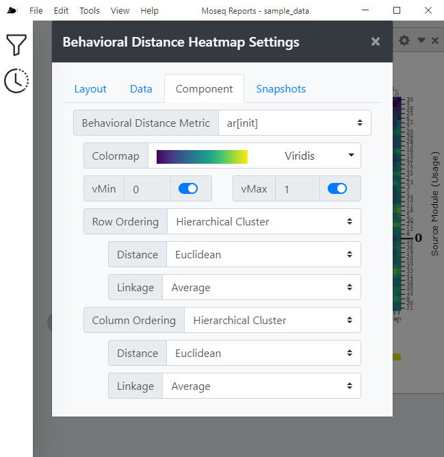

## Crowd Movies
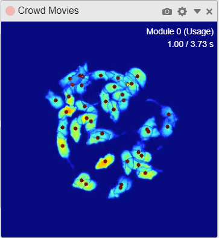
This component displays “crowd movies”, or videos where many examples of a given moseq syllable which are synchronized to the syllable start and overlaid. A red dot over each mouse indicates the active performance of the current syllable.
 

### Settings
Setting|Description
:--|:--
Loop Playback|Enabling this setting will cause the movie to loop back to the beginning and play again once the video has completed playing. Disabling this setting will cause the video to stop once it has completed playing.
Playback Rate|Sets the playback rate of the video. A value of one (1.0) results in normal playback speed. Values greater than 1.0 result in faster playback, and values less than 1.0 (but greater than zero) result in slower playback. For example, a value of 0.5 will cause the video to play at half the normal speed.

## Individual Usage Heatmap

Displays a Heatmap of the magnitude of distance for one specific group inside a moseq module. This component inherits all settings from the Usage Heatmap.

|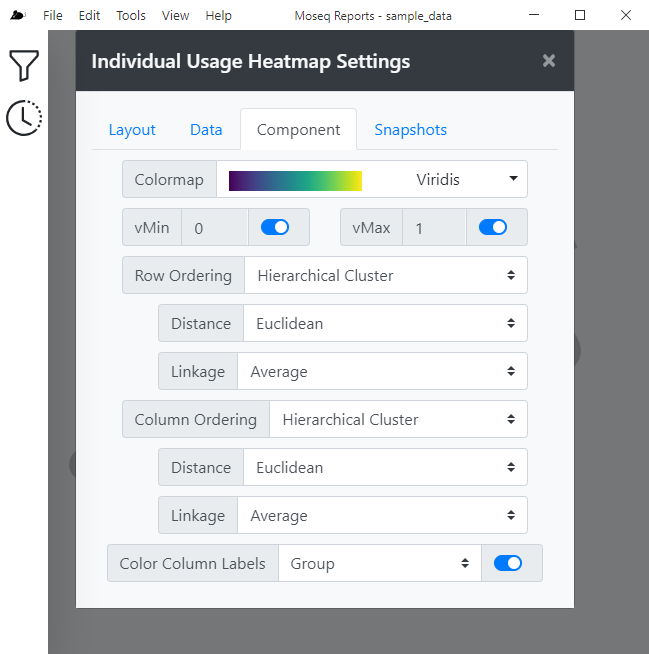
:-------------------------:|:-------------------------:
Heatmap|Options

### Colormap
Changes the color spectrum for which cells are shaded.
### vMin and vMax
Changes the minimum and maximum values displayed on heatmap.
### Row and Column Ordering
#### ID
Sort by ordering of module labels, most used animal
#### Value
Sort by values
#### Hierarchical Cluster
Uses hierarchical clustering to define the order. Organizes rows such that close together are physically close and vice versa.
#### K-Means Cluster
Performs k means clustering over data and ordering is used. Shows breaks between clusters.
#### Dataset
Use an arbitrary dataset to define the order. Allows order from different comonents to be used. Datasets are generated by other heatmaps. 
### Color Column Labels

## Module Clips
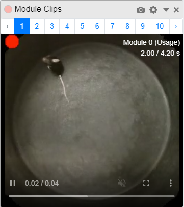|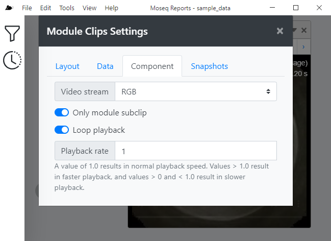
:-------------------------:|:-------------------------:
Clip|Options

### Video Stream
Allows the clip to be shown in RGB, as a depthmap, or both side by side.
### Only Module Subclip
Excludes context of pre and post behavior.
### Loop Playback
Loops the current clip.
### Playback Rate
Changes the speed at which the clip is running.

## Position Plot
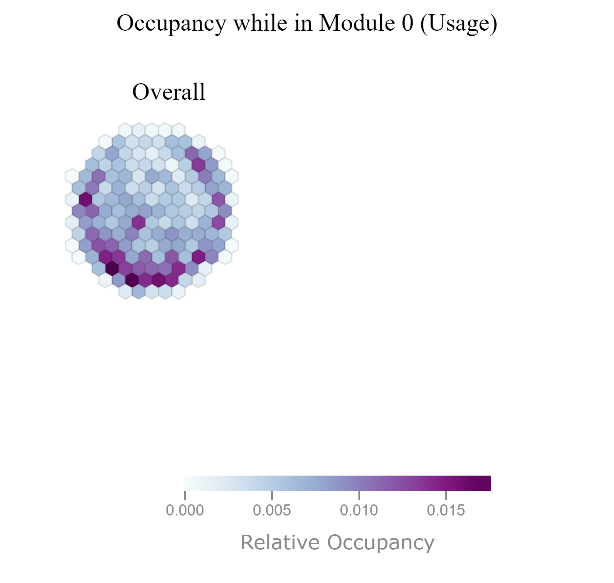|
:-------------------------:|:-------------------------:
Plot|Options

### Display Mode
Changes whether position plot for all data groups combined(Overall) or individually(Grouped).
### Colormap
Changes the color spectrum for which cells are shaded.
### Resoution
Increases(lower value) or decreases(higher value) the resolution of the plot. 

## Sample Viewer
This component displays general information such as UUID, Group, Apparatus, Session Name, Subject Name, and Acquisition Time of the groups in the dataset while also allowing this data to be filtered by any of this information. This component has no additional settings.

## Scalar Data
|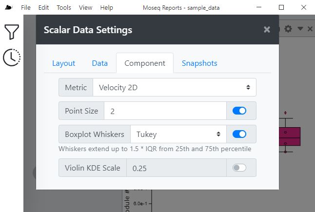
:-------------------------:|:-------------------------:
Data|Options

### Metric
Selection of metrics for the given data to be displayed.
### Point Size
Changes the size of the point.
### Boxplot Whiskers
Select between Tukey and Min/Max boxplot whiskers.
### Violin KDE Scale
Modifies the scale of the Violin KDE.

## Selected Syllable

## Spinogram
|
:-------------------------:|:-------------------------:
Spinogram|Options

### Line Weight and Color
Changes the thickness and color of the displayed lines.

## State Map
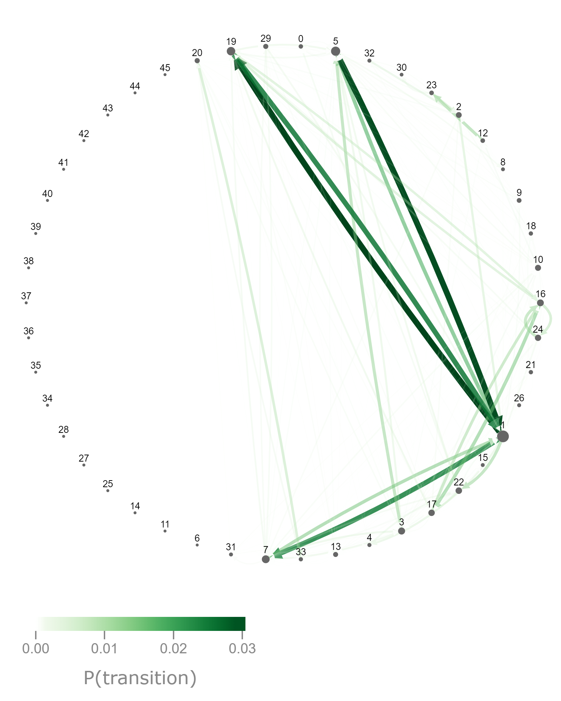|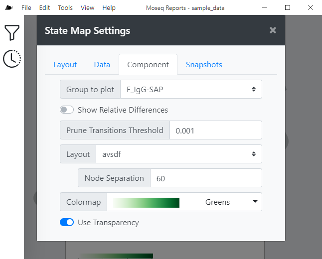
:-------------------------:|:-------------------------:
Map|Options

### Group to Plot
Select the group to display.
### Show Relative Differences
Subracts values of group B from group A. Plot those relative differences.
### Prune Transition Threshold
Value indicates which values to be excluded from plot, can get busy at very low values.
### Layout
Select the layout the map should be displayed in.
### Colormap
Changes the color spectrum for which lines are shaded.
### Use Transparancy

## Syllable Flow
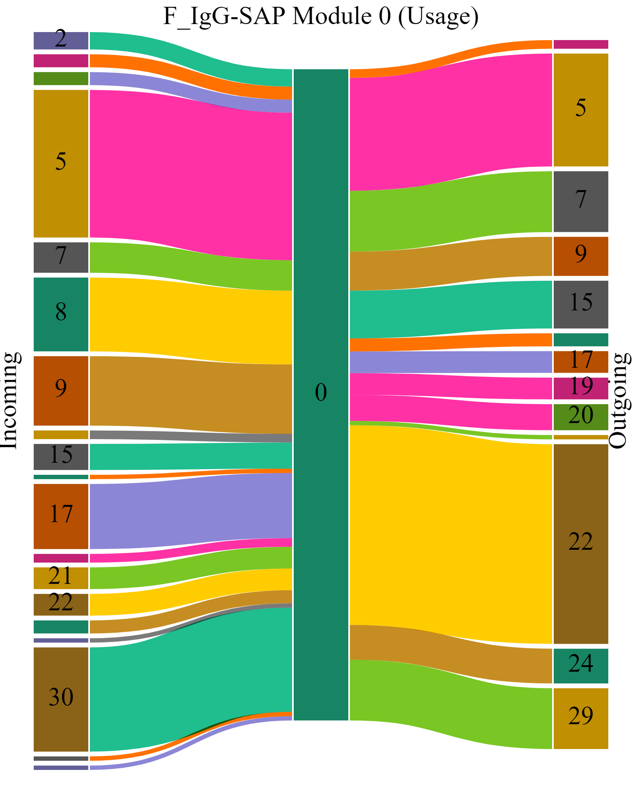|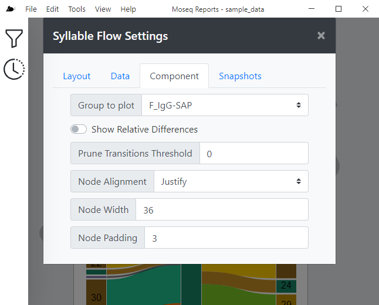
:-------------------------:|:-------------------------:
Syllable Flow|Options

### Group to Plot
Select the group to display.
### Show Relative Differences
### Prune Transition Threshold
### Node Alignment
### Node Width and Padding
Changes the width of each node and the space between them.

## Usage Details
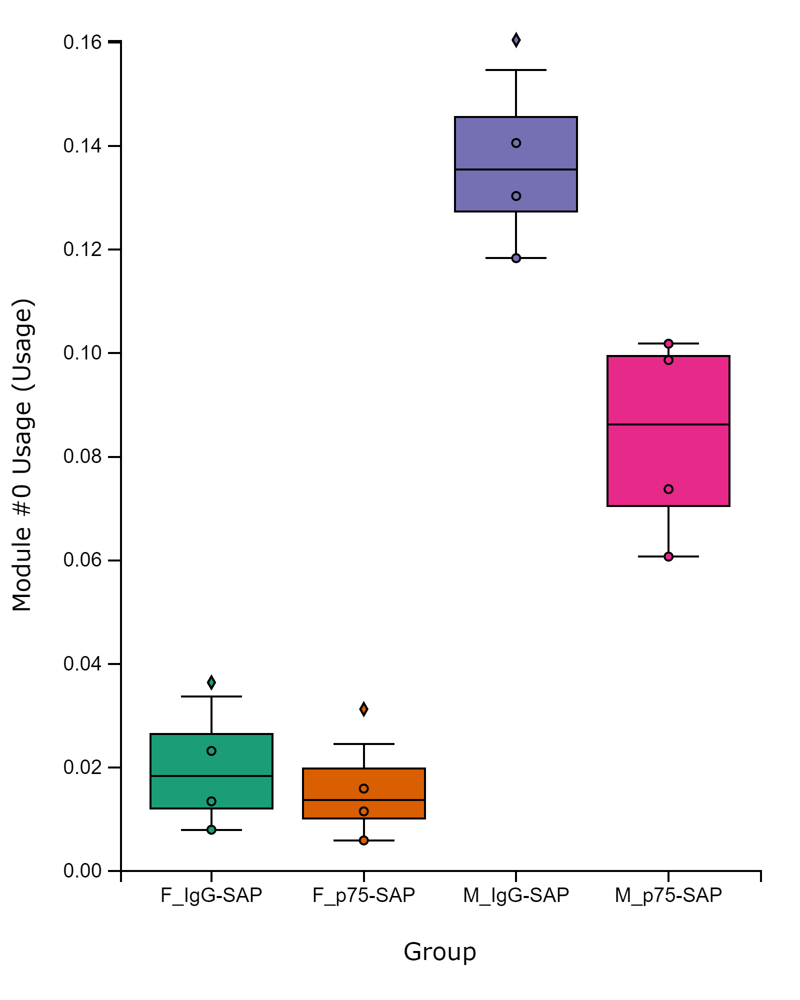|
:-------------------------:|:-------------------------:
Usage Details|Options

### Group Ordering
Change order of groups by filter order or by dataset.
### Point Size
Changes the size of the point.
### Boxplot Whiskers
Select between Tukey and Min/Max boxplot whiskers.
### Violin KDE Scale
Modifies the scale of the Violin KDE.

## Usage Heatmap
Displays a heatmap, describing the magnitude of distance of different groups, of the current dataset. The heatmap can be clicked to change the current Selected Syllable, affecting the rest of the component's data. This component has the following settings:
* Colormap - Changes color scheme of Heatmap
* Syllable Ordering - Ability to toggle ordering of modules between:
    * Syllable ID
    * Syllable Value
    * Clustered
    * Dataset
* Group Ordering - Changes order of the groups, can be set to the data source order or clustered, which lets distance and linkage be taken into account.

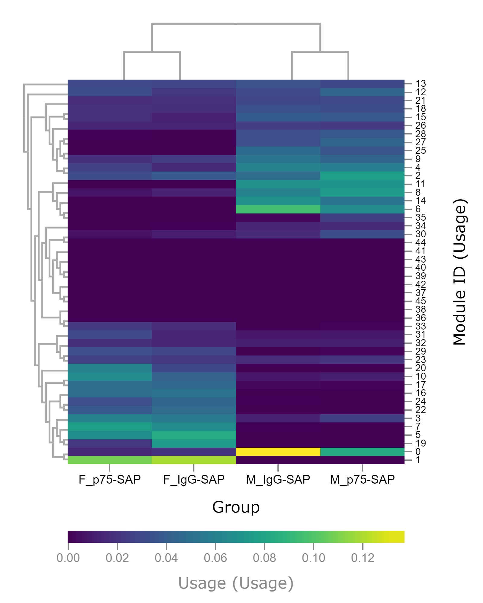|
:-------------------------:|:-------------------------:
Heatmap|Options

### Colormap
Changes the color spectrum for which cells are shaded.
### vMin and vMax
Changes the minimum and maximum values displayed on heatmap.
### Row and Column Ordering
#### ID
Sort by ordering of module labels, most used animal
#### Value
Sort by values
#### Hierarchical Cluster
Uses hierarchical clustering to define the order. Organizes rows such that close together are physically close and vice versa.
#### K-Means Cluster
Performs k means clustering over data and ordering is used. Shows breaks between clusters.
#### Dataset
Use an arbitrary dataset to define the order. Allows order from different comonents to be used. Datasets are generated by other heatmaps. 